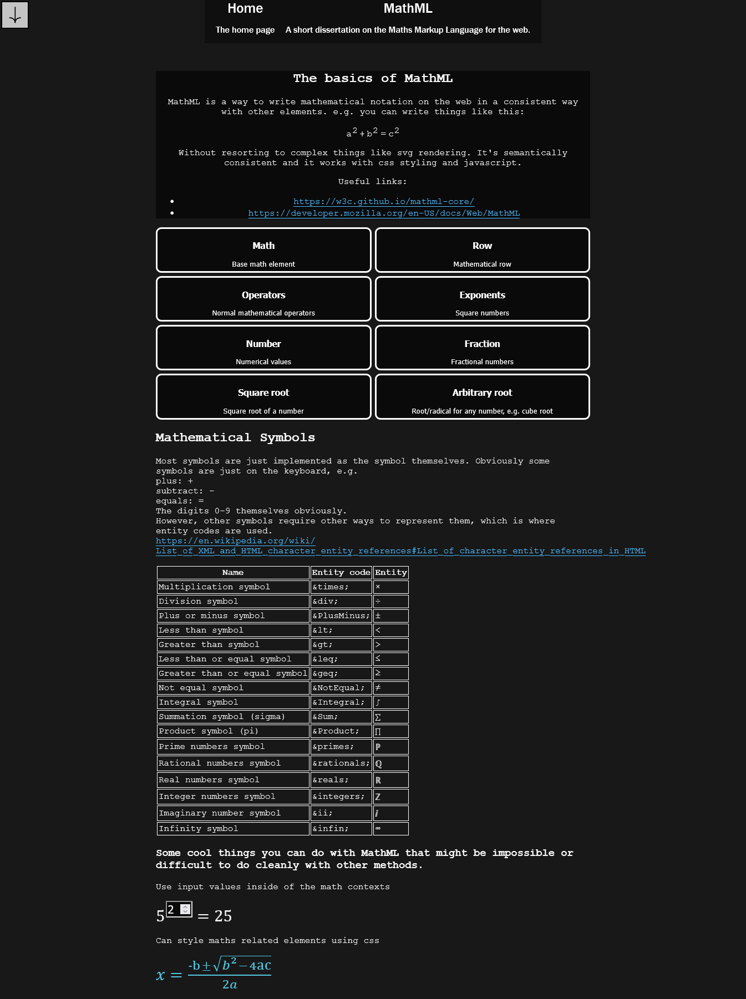
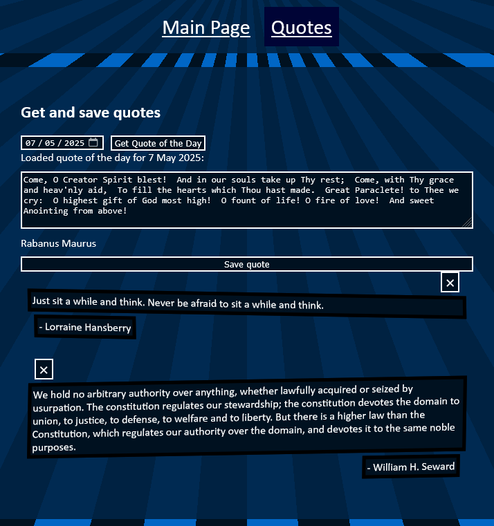
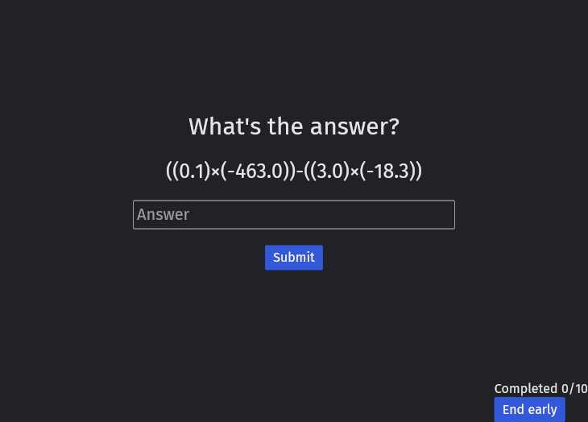
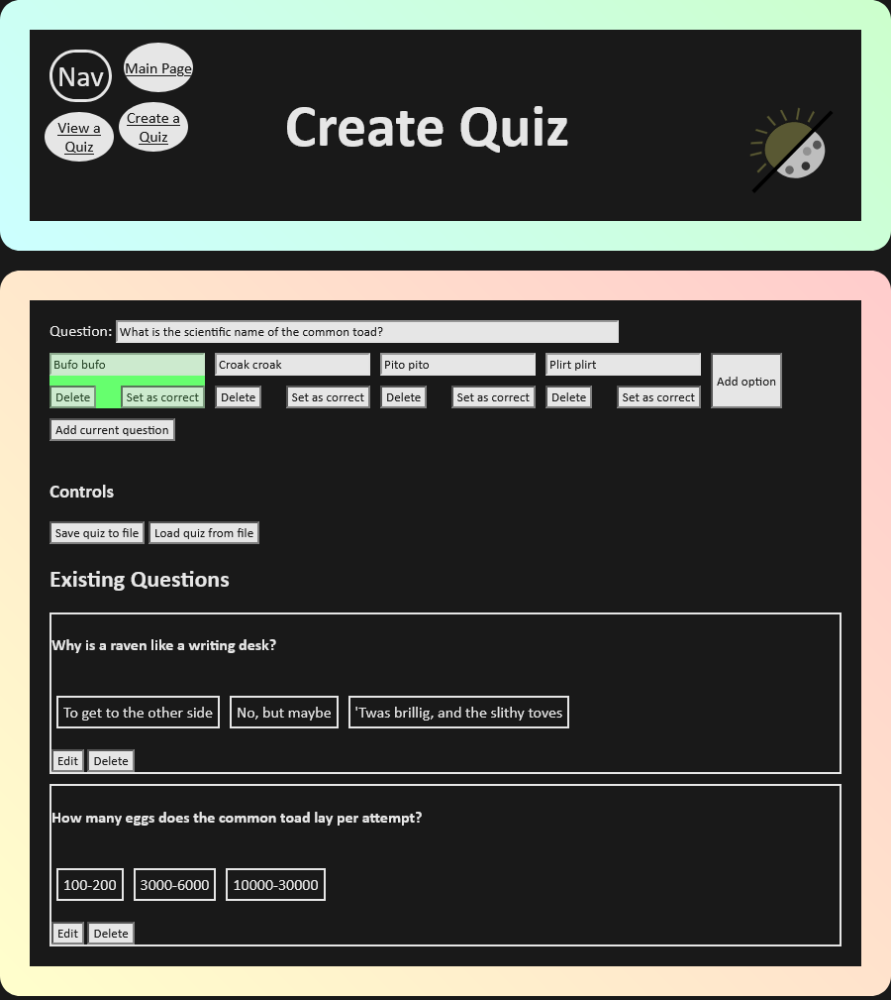

# What is this?

This is a small collection of projects just messing around with a few different web frameworks for building GUIs.   
Just want to experiment at this point without building anything deep and learn new things.  

## Apps

These are the GUI apps built so far (in order). The thoughts on them can be found in the thoughts.md file for each one. None of these are serious projects, just little toy things to learn the language/framework.

### svelte

Wanted to learn svelte since it's apparently pretty cool, so made a small web app explaining the MathML spec using it. Also messed around a bit with scroll effects and threlte (library for using three.js in svelte).

Try at https://tristanphease.github.io/gui-frameworks/svelte

### elm

Wanted to use elm for a few reasons, mainly that the creator evancz seems pretty cool and also wanted to learn a pure functional language. This app was an app that gets quotes of the day from the wikiquote API (which requires a bit of parsing since the APIs don't provide them in a convenient format) and saves them to the localstorage.

Try at https://tristanphease.github.io/gui-frameworks/elm

### iced

Wanted to learn iced since wanted to see how a GUI app using Rust would go, definitely pretty cool. The types in Rust wasn't so much of an issue but would struggle to make much complicated in this. It's also more of a native app builder, since one needs to use tauri and WASM to get this to run in the web and even then there are some issues. The app is one where you solve simple maths calculations 

**Note that the text on the main menu is broken since it's meant to be bold which doesn't seem to work, the buttons go easy / medium / difficult**  
Try at https://tristanphease.github.io/gui-frameworks/iced

### Bolero

Wanted to learn F# since it's "wagie OCaml" and it's neat to see how it interacts with the other .NET languages and infrastructure. The app is one where you can build quizzes, save them to a json file and load them.

Try at https://tristanphease.github.io/gui-frameworks/bolero
